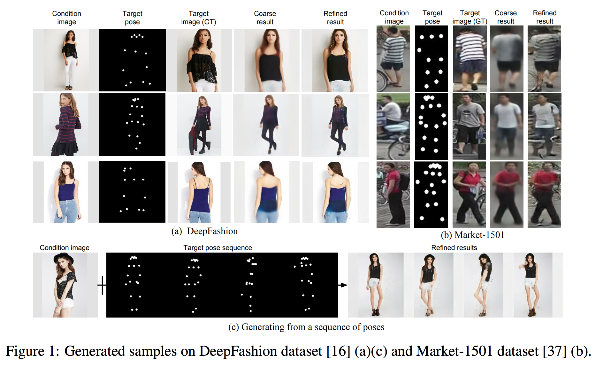
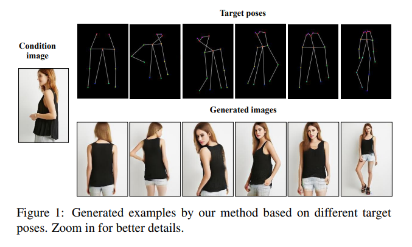

# Pose Guided Person Image Generation
### What is Pose Guided Person Image Generation (PGPIG)?
+ PGPIG是指“姿态引导的人物图像生成”，它的任务是将一个人物图像从源姿态转换为给定的目标姿态。
+ 这个任务有很多应用，比如电子商务、电影特效、人物再识别等。由于姿态转换会导致纹理和几何形状的显著变化，因此PGPIG仍然是一个具有挑战性的任务。
+ 近年来，随着生成模型的不断发展，如生成对抗网络（GANs）和变分自编码器（VAEs），PGPIG已经取得了很大的进展。

## 论文综述
### 2017
+ 第一次提出"Pose Guided Person Image Generation" （CVPR 2017） [[Paper]](https://arxiv.org/abs/1705.09368) [[Code]](https://github.com/chuanqichen/deepcoaching)

### 2018

### 2018
### 2019
+ [[GAN]]()PATN: Pose Attention Transfer Network (CVPR 2019) [[Paper]](https://arxiv.org/pdf/1904.03349.pdf)
  + proposes a new generative adversarial network for pose transfer, i.e., transferring the pose of a given person to a target pose. 
  + The generator of the network comprises a sequence of Pose-Attentional Transfer Blocks that each transfers certain regions it attends to, generating the person image progressively.

### 2020
+ [[GAN]]() Xinggan for person image generation (ECCV 2020) [[Paper]](https://arxiv.org/pdf/2007.09278.pdf)
  + The proposed Xing generator consists of two generation branches that model the person's appearance and shape information, respectively.
  + Moreover, we propose two novel blocks to effectively transfer and update the person's shape and appearance embeddings in a crossing way to mutually improve each other, which has not been considered by any other existing GAN-based image generation work.
  + 在PATN中添加了更多的姿态和外观之间的交叉方式。
+ [[Optical flow]]() Deep Image Spatial Transformation for Person Image Generation (CVPR 2022) [[Paper]](https://arxiv.org/abs/2003.00696)
  + propose a differentiable global-flow local-attention framework to reassemble the inputs at the feature level. 
  + Specifically, our model first calculates the global correlations between sources and targets to predict flow fields. 
  + Then, the flowed local patch pairs are extracted from the feature maps to calculate the local attention coefficients. Finally, we warp the source features using a content-aware sampling method with the obtained local attention coefficients. 
### 2021
### 2022
+ DPTN：Dual-task Pose Transformer Network (CVPR 2022) [[Paper]](https://arxiv.org/abs/2203.02910) [[Code]](https://github.com/PangzeCheung/Dual-task-Pose-Transformer-Network)
  + DPTN的主要目标是解决PGPIG由于姿态转换会导致纹理和几何形状的显著变化，因此难以生成具有任意给定姿态的人物图像。
  + 为了解决这个问题，DPTN通过Siamese结构引入了一个辅助任务（即源到源任务），并利用其知识来辅助源到目标的学习。
### 2023
